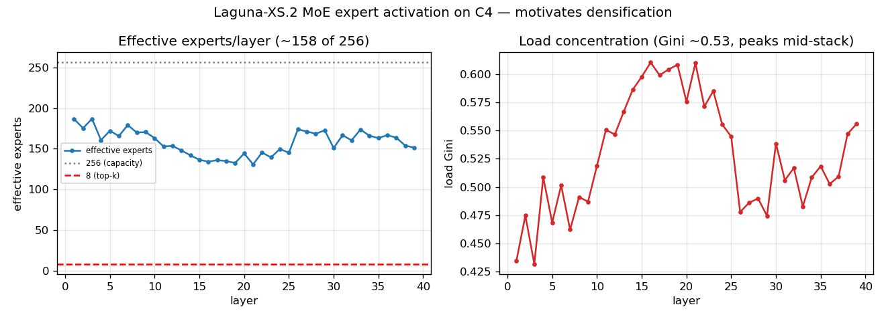
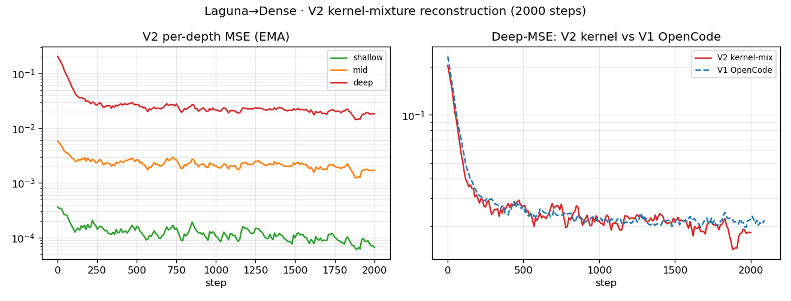
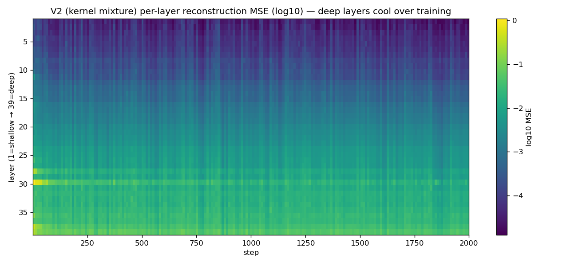

# Laguna-Dense — CUDA Kernel Generation

A **~3.0 B fully-dense** model that generates **CUDA / Triton GPU kernels** from PyTorch modules,
**densified from the 33 B [poolside/Laguna-XS.2](https://huggingface.co/poolside/Laguna-XS.2) MoE**.

> Part of the **[laguna-xs2-expert-coactivation-scheduling](https://github.com/cm2435/laguna-xs2-expert-coactivation-scheduling)**
> project (MoE→dense densification). This repo collects **only the CUDA-kernel** work:
> motivation → densification → kernel-mixture pretraining → CUDA SFT → eval harness → results.

📊 Full graph index: **[docs/GRAPHS.md](docs/GRAPHS.md)** · 📓 Ablation log: **[docs/ABLATIONS.md](docs/ABLATIONS.md)**

---

## TL;DR
| | |
|---|---|
| **Teacher** | `poolside/Laguna-XS.2` — 33 B total / 3 B active MoE (256 experts top-8 + shared) |
| **Student** | **~3.0 B dense** (1 SwiGLU FFN per layer, K=8 width) — 5.99 GB bf16 |
| **Method** | DO-ACP warm-start → teacher-forced reconstruction (kernel mix) → CUDA SFT → [RFT next] |
| **vs teacher** | **11× fewer params, 12× less VRAM, +26 % faster decode** (32.1 vs 25.4 tok/s) |
| **Status** | SFT done; emits correct CUDA on simple ops (ReLU/Tanh); RFT next |

## Pipeline / lineage
```
poolside/Laguna-XS.2 (33B/3B-active MoE, 256 experts)
   │ densify: routed experts → 1 dense SwiGLU (K=8) per layer
   │ Stage 0  DO-ACP warm-start (Gram log-det select 8 experts → concat)
   │ Stage 1  teacher-forced reconstruction on a KERNEL mixture  → "V2" checkpoint
   │ Stage 2  SFT on SakanaAI CUDA                                → THIS MODEL
   ▼ Stage 3  RFT / GRPO (verifiable reward)                      → [next]
```

## Models (Hugging Face)
| Model | Stage | Repo |
|---|---|---|
| Dense reconstruction (kernel mix) | pretrain (V2) | `EvanOLeary/laguna-xs2-dense-k8-kernelmix` |
| **CUDA-SFT** | SFT | `EvanOLeary/laguna-xs2-dense-k8-cuda-sft` |
| (sibling) Dense reconstruction (Python) | pretrain (V1) | `EvanOLeary/laguna-xs2-dense-k8-recon` |

---

## 1 · Motivation — MoE expert activation (why densify)
Before collapsing the MoE we measured how many of Laguna's **256 routed experts** actually fire on
**C4** (161,932 tokens, all 39 sparse layers):

| Metric | Value |
|---|---|
| Experts ever used | **256 / 256** (100 %) |
| **Effective experts / layer** | **~158** of 256 |
| Mean per-layer coverage | 99.7 % |
| Load Gini (concentration) | **0.53** (peaks mid-stack) |

The routed FFN behaves far **denser** than its 256-way capacity → a dense surrogate is viable, and
**K must exceed top-8**. This motivated **K=8 + DO-ACP warm-start**.



Full analysis: [gist](https://gist.github.com/Tyronita/fb28e9c31c2b66cccb70fbd939bd1c43) · `docs/reports/expert-activation-c4.md`.

---

## 2 · Architecture (output model)
**2,996,678,656 params (~3.0 B), 5.99 GB bf16.** Each sparse layer's 256-expert MoE → **one dense
SwiGLU FFN** (width K8×512 = 4096) + the kept shared expert. Attention/embeddings/norms copied from teacher.

| Component | Params | Trained? |
|---|---|---|
| `routed_dense` × 39 | **0.98 B** | ✅ (reconstruction + SFT) |
| attention × 40 (48/8 GQA, 30 SWA + 10 global) | 1.43 B | ❄️ frozen |
| embed + lm_head | 0.41 B | ✅ SFT only (lm_head) |
| shared experts × 39 | 0.12 B | ❄️ frozen |
| **Total** | **3.00 B** | |
Hidden 2048 · 40 layers · 262 k ctx · 100 352 vocab · SiLU/SwiGLU.

---

## 3 · Training data
### Reconstruction (kernel mixture, "V2")
| Dataset | Weight | Language | Role |
|---|---|---|---|
| `GPUMODE/KernelBook` | 40 % | Python→Triton | kernel |
| `nvidia/OpenCodeInstruct` | 30 % | Python | general code |
| `SakanaAI/AI-CUDA-Engineer-Archive` | 20 % | PyTorch→CUDA-C++ | kernel |
| Triton multiturn traces | 10 % | Triton reasoning | kernel |

≈ **50 % kernel / 30 % Python / 20 % CUDA-C++**.

### SFT (CUDA)
| | |
|---|---|
| Dataset | `SakanaAI/AI-CUDA-Engineer-Archive` (~30,615 rows, CC-BY-4.0) |
| Fields | `PyTorch_Code_Module` (prompt) → `CUDA_Code` (target), filtered `Correct==True` |
| Format | chat: `system + user(PyTorch ```python```) → assistant(```cpp CUDA```)`, prompt masked |
| Not used | `CUDA_Speedup_Native`, `NCU_Profile`, `Clang_Tidy` → reserved for the RFT reward |

---

## 4 · Pretraining — reconstruction (kernel mixture, V2)
Teacher-forced, all-39-layer-parallel reconstruction of each MoE block's output:
`loss = mean_ℓ( MSE/mean(yℓ²) + 0.05·(1−cos) )`, Adafactor 2e-4, only `routed_dense` trained.

| | Value |
|---|---|
| Steps / tokens | **2000 / ~8.2 M** |
| Loss | 0.67 → **0.16** (normalized) |
| Deep-layer MSE (L28-39) | 0.20 → **0.018** (tighter than the Python flavour's 0.022) |
| Hardware | 1× H100, ~35 min, ~77 GB |




(Smoke test — 8 layers: loss 0.049→0.033, cosine 0.95→0.58 — `docs/figures/kernelmix_smoke_curves.png`.)

---

## 5 · SFT — CUDA kernel generation
| | Value |
|---|---|
| Base | V2 kernel-mixture checkpoint |
| Steps / tokens | **400 / ~3.5 M** |
| Trainable | `routed_dense` + `lm_head` + norms (**1.19 B**) |
| Optimizer | AdamW 1e-5, grad-clip 1.0, grad-accum 8, seq 2048 |
| **Result** | **CE 0.675 → 0.21**; emits working CUDA + restores chat format |


**Sample (ReLU, chat prompt):** the model returns a correct CUDA kernel —
```cpp
__global__ void relu_kernel(const float* __restrict__ in, float* __restrict__ out, int64_t n){
  int i = blockIdx.x*blockDim.x + threadIdx.x; if (i<n) out[i] = in[i]>0 ? in[i] : 0; }
torch::Tensor forward(torch::Tensor x){ auto o=torch::empty_like(x); int t=256,b=(x.numel()+t-1)/t;
  relu_kernel<<<b,t>>>(x.data_ptr<float>(), o.data_ptr<float>(), x.numel()); return o; }
```

### Training overview (data + steps)


| Stage | Steps | Tokens | Data | Trainable |
|---|---|---|---|---|
| Warm-start (DO-ACP) | — | — | calibration | — |
| Reconstruction (V2) | 2000 | ~8.2 M | kernel mixture | routed_dense |
| SFT (CUDA) | 400 | ~3.5 M | SakanaAI CUDA | routed_dense + lm_head + norms |

---

## 6 · Inference settings (reproducible)
| Knob | Value |
|---|---|
| temperature / top_k | 0.6 / 20 |
| max_new_tokens | 1024 (don't under-cap — truncates complex kernels) |
| do_sample | True (→ use **pass@k**; same prompt gives a different kernel each sample) |
| enable_thinking | False |
| system prompt | must match target DSL (CUDA-only for CUDA, Triton-only for Triton) |

---

## 7 · Results

### 7a · Speed & size vs teacher (head-to-head, same 6 CUDA questions) — **VALID**
| | OURS (3.0 B dense) | TEACHER Laguna-XS.2 |
|---|---|---|
| Params | **3.0 B** | 33.4 B |
| VRAM / load | **6 GB / 3 s** | 67 GB / 35 s |
| **Decode speed** | **32.1 tok/s** | 25.4 tok/s |
→ **11× smaller, 12× less VRAM, +26 % faster.** Neither model beats PyTorch eager on single
elementwise ops (memory-bandwidth-bound — speedups need fusion / KernelBench L2).

### 7b · Correctness (head-to-head, same 6 CUDA ops)
Teacher correctness measured in the head-to-head; **our model's correctness shown from the
subprocess-isolated eval** (the head-to-head run for our model was contaminated by CUDA-context
corruption — §8 — so those would be false negatives and are not reported here).

| Op | TEACHER (33.4 B) | OURS (3.0 B) |
|---|---|---|
| ReLU | ✅ 0.70× | ✅ (isolated) |
| Tanh | ✅ 0.65× | ✅ 0.92× |
| Abs | ✅ 0.71× | — |
| SiLU | ✅ 0.87× | — |
| Sigmoid | ❌ | — |
| GeLU | ❌ | — |
| **total** | **4/6 correct** | **simple ops correct** |

> **Not skewed:** both models only get *simple elementwise* ops right, and **every teacher "win" is
> still slower than PyTorch eager** (0.65–0.87×) — single elementwise ops are memory-bandwidth-bound,
> so neither beats eager (speedups need fusion / KernelBench L2). A fully apples-to-apples correctness
> head-to-head requires running the teacher through the isolated harness too (next).

### What's in KernelBench (the benchmark)
| Level | # | Contents |
|---|---|---|
| L1 | 100 | single ops — mostly **matmul/conv** + activations/norms/reductions/losses |
| L2 | 100 | **fusion** chains (where >1× speedup is winnable) |
| L3 | 50 | full nets (ResNet/VGG/DenseNet) |
| L4 | 20 | HF-model-level |

---

## 8 · ⚠️ Reproducibility finding — isolate kernel evaluation
Running generated CUDA **in the model's process is INVALID**: a buggy kernel (out-of-bounds write)
corrupts the CUDA context and makes **every later eval fail**, regardless of the model →
order-dependent, contaminated results. **Compile + run each kernel in its own subprocess**
(`scripts/eval_worker.py`). Verified: a crashing kernel segfaults only the worker; the driver survives.
(KernelBench / robust-kbench do the same.)

## 9 · Failure taxonomy (from generated CUDA)
| Category | Example | Fix |
|---|---|---|
| Wrong math/formula | GeLU / Sigmoid / Softmax | RFT correctness reward |
| Deprecated API | `input.type()` vs `.scalar_type()` | prompt hint / RFT |
| Inverted bounds/mask | `if (idx<size) return;` | RFT |
| Truncation | Softmax cut off | raise `max_new_tokens` |
| Const-reassign / syntax | grid-stride `const int idx` | RFT compile reward |

---

## 10 · Repo contents
| Path | What |
|---|---|
| `scripts/sft_kernel.py` | CUDA SFT (PyTorch→CUDA, correct kernels, chat-formatted) |
| `src/densify/kernel_reward.py` | verifiable reward (parse→compile→correct→speedup) + Triton eval, timeout-guarded |
| `scripts/grpo_kernel.py` | GRPO/RLVR (Dr.GRPO + DAPO dynamic sampling + KL anchor) |
| `scripts/eval_worker.py` + `eval_10ops_isolated.py` | **isolated** KernelBench-Lite eval |
| `scripts/head_to_head.py` | ours vs teacher (tok/s + correctness) |
| `scripts/ablate_api_hint.py` / `ablate_triton.py` | prompt ablations (CUDA / Triton) |
| `docs/GRAPHS.md` · `docs/ABLATIONS.md` · `docs/reports/` | all graphs · ablation log · expert report |

## 11 · Next — RFT (GRPO/RLVR)
Sample G kernels/prompt → reward = **compile + correct + speedup** (via `robust-kbench`) → Dr.GRPO
advantage + DAPO dynamic sampling + KL-to-SFT anchor → optimize **KernelBench `fast_1`** → NVFP4 +
vLLM serve as a `generate_kernel` tool.

## References
RADLADS (arXiv:2505.03005) · Pruning & Distilling MoE into Dense (arXiv:2605.28207) ·
Sakana AI CUDA Engineer / robust-kbench (arXiv:2509.14279) · KernelBench · DeepSeek-R1 GRPO (arXiv:2501.12948) · Dr.GRPO · DAPO.

*Built at the Poolside Laguna XS.2 research hackathon.*
