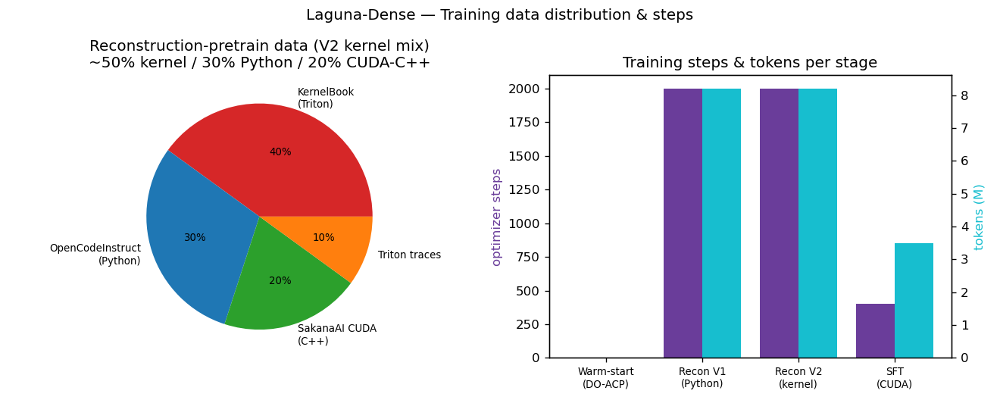
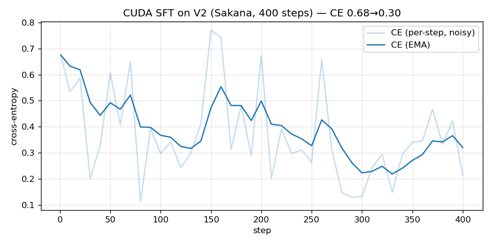

# Laguna-Dense CUDA Kernel Generation

A **~3.0 B dense** model that generates **CUDA / Triton GPU kernels** from PyTorch modules —
densified from the **[poolside/Laguna-XS.2](https://huggingface.co/poolside/Laguna-XS.2)** 33 B MoE.

> Part of the **[laguna-xs2-expert-coactivation-scheduling](https://github.com/cm2435/laguna-xs2-expert-coactivation-scheduling)**
> project (MoE→dense densification). This repo collects **only the CUDA-kernel** work: SFT, the
> kernel reward, the isolated eval harness, and reproducible results.

## Models (Hugging Face)
| Model | Stage | Repo |
|---|---|---|
| Dense reconstruction (kernel mix) | pretrain | `EvanOLeary/laguna-xs2-dense-k8-kernelmix` |
| **CUDA-SFT** | SFT on Sakana CUDA | `EvanOLeary/laguna-xs2-dense-k8-cuda-sft` |

## Pipeline
```
Laguna-XS.2 MoE → densify (K=8 dense SwiGLU) → DO-ACP warm-start
   → reconstruction-pretrain (kernel mixture) → SFT (SakanaAI/AI-CUDA-Engineer-Archive)
   → [RFT/GRPO with verifiable reward — next]
```

## Initial investigation — MoE expert activation (why densify)
Before collapsing the MoE, we measured **how many of the 256 routed experts actually fire** on C4
(161,932 tokens, all 39 sparse layers): **all 256 used, but only ~158 effective experts/layer**
(load Gini ≈ 0.53). The routed FFN behaves far denser than its 256-way capacity → a dense surrogate
has a realistic target, and K should exceed top-8. This motivated **K=8 + DO-ACP warm-start**.
- Gist: https://gist.github.com/Tyronita/fb28e9c31c2b66cccb70fbd939bd1c43
- Report: `docs/reports/expert-activation-c4.md` · Script: `scripts/analyze_expert_activation.py`

## Training overview — data & steps


| Stage | Steps | Tokens | Data | Trainable |
|---|---|---|---|---|
| Warm-start (DO-ACP) | — | — | calibration | — |
| Recon V1 (Python) | 2000 | ~8.2M | OpenCodeInstruct | routed_dense |
| Recon V2 (kernel) | 2000 | ~8.2M | KernelBook40 / OpenCode30 / SakanaCUDA20 / traces10 | routed_dense |
| SFT (CUDA) | 400 | ~3.5M | SakanaAI/AI-CUDA-Engineer-Archive (correct only) | routed_dense+lm_head+norms |

**Reconstruction V2 mixture:** ≈ 50% kernel / 30% Python / 20% CUDA-C++.
**DSLs:** CUDA (SFT-trained) and Triton (pretrain-only) — per-DSL pass@k results pending the isolated eval (not yet measured).



## Reproducible results (valid settings)
**Inference settings:** `temperature=0.6, top_k=20, max_new_tokens=1024, do_sample=True, enable_thinking=False`.
Pass@k because generation is stochastic (same prompt → different kernel each sample).

### Speed & size vs teacher (head-to-head, same 6 CUDA questions) — VALID
| | OURS (dense SFT) | TEACHER Laguna-XS.2 |
|---|---|---|
| Params | **3.0 B** | 33.4 B |
| VRAM / load | **6 GB / 3 s** | 67 GB / 35 s |
| **Decode speed** | **32.1 tok/s** | 25.4 tok/s |

→ **11× smaller, ~12× less VRAM, +26% faster decode.** (Generation speed is unaffected by the
eval-isolation issue below, so these numbers are reproducible.)

### Kernel correctness
- Simple elementwise ops (ReLU, Tanh) compile + are numerically correct at **pass@k** (k≥3); a
  generated Tanh kernel ran at **0.92×** vs PyTorch eager.
- Complex ops (GeLU math, Softmax reductions) are structurally right but often numerically wrong → the RFT target.
- **Neither our model nor the 33 B teacher beats PyTorch eager** on single elementwise ops — expected:
  these are memory-bandwidth-bound and eager already saturates bandwidth. Speedups need **fusion**
  (KernelBench L2), not single ops.

## ⚠️ Critical reproducibility finding — isolate kernel evaluation
Running generated CUDA **in the same process** as the model is **invalid**: a buggy kernel
(out-of-bounds write) corrupts the CUDA context and makes **every subsequent eval fail**, regardless
of the model — producing order-dependent, contaminated results. **Each kernel must be compiled+run in
its own subprocess** (`scripts/eval_worker.py`). Verified: a crashing kernel segfaults only the
worker; the driver survives. (KernelBench / robust-kbench do the same.)

## Failure taxonomy (from generated CUDA)
| Category | Example | Fix |
|---|---|---|
| Wrong math/formula | GeLU/Sigmoid/Softmax | RFT correctness reward |
| Deprecated API | `input.type()` vs `.scalar_type()` | prompt hint / RFT |
| Inverted bounds/mask | `if (idx<size) return;` | RFT |
| Truncation | Softmax cut off | raise `max_new_tokens` |
| Const-reassign / syntax | grid-stride `const int idx` | RFT compile reward |

## Repo contents
- `scripts/sft_kernel.py` — CUDA SFT (PyTorch→CUDA, correct kernels, chat-formatted).
- `src/densify/kernel_reward.py` — verifiable reward (parse→compile→correct→speedup) + Triton eval, timeout-guarded.
- `scripts/grpo_kernel.py` — GRPO/RLVR (Dr.GRPO + DAPO dynamic sampling + KL anchor).
- `scripts/eval_worker.py` + `eval_10ops_isolated.py` — **isolated** KernelBench-Lite eval.
- `scripts/head_to_head.py`, `ablate_api_hint.py`, `ablate_triton.py` — comparisons / prompt ablations.
- `docs/ABLATIONS.md` — inference-knob ablation log + failure taxonomy.

## Next
RFT (GRPO) on the verifiable reward → KernelBench `fast_0`/`fast_1` → NVFP4 + vLLM serve as a `generate_kernel` tool.

*Refs: RADLADS arXiv:2505.03005 · MoE→Dense arXiv:2605.28207 · Sakana AI CUDA Engineer / robust-kbench arXiv:2509.14279 · KernelBench · Dr.GRPO · DAPO.*
