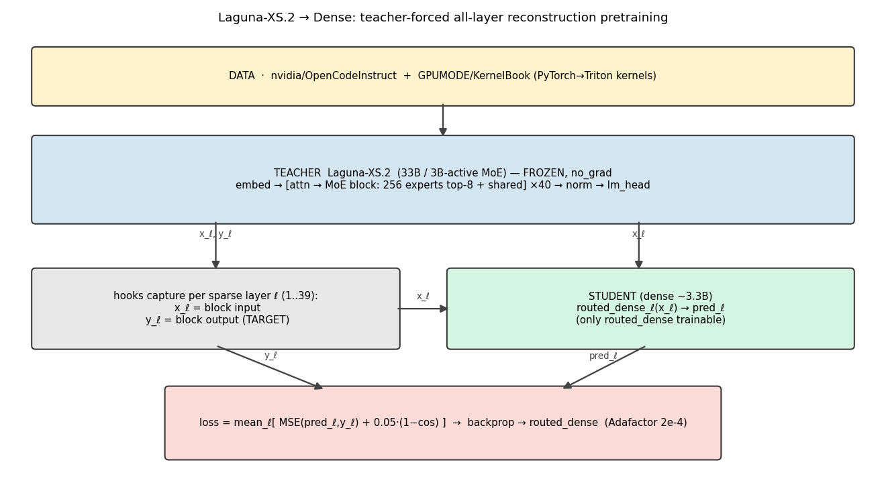
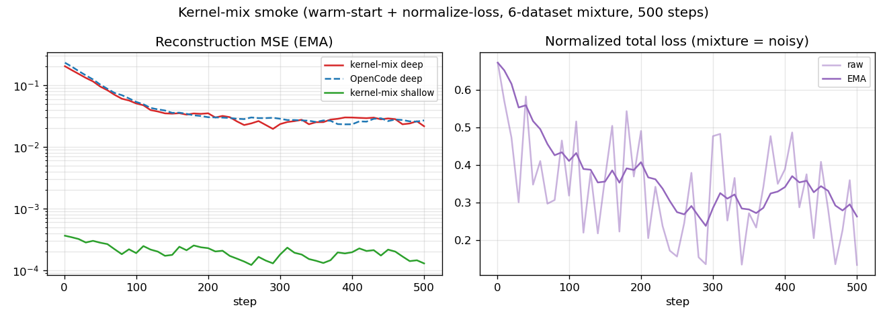
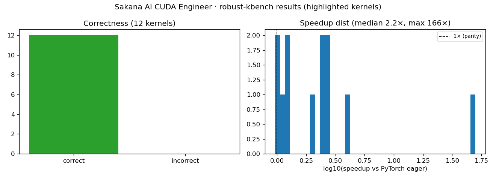

# Graphs & Diagrams — Laguna-Dense CUDA Kernels

All loss curves, distributions, and diagrams for **this model's lineage**:
`Laguna-XS.2 MoE → DO-ACP warm-start → reconstruction-pretrain (KERNEL mixture, "V2") → SFT (CUDA)`.

> Note: the pretraining graphs here are the **kernel-mixture (V2)** run — the actual ancestor of the
> CUDA-SFT model. (A separate Python flavour was pretrained on OpenCodeInstruct; its graphs are **not**
> shown here because it is **not** this model's lineage.)

## 0. Motivation — MoE expert activation (why densify)
Before collapsing the MoE, we measured how many of Laguna's **256 routed experts** actually fire on
C4 (161,932 tokens, all 39 sparse layers): **all 256 used, but only ~158 effective experts/layer**
(load Gini ≈ 0.53, concentration peaks mid-stack). The routed FFN behaves far denser than its 256-way
capacity → a dense surrogate is viable, and K should exceed top-8. **This motivated K=8 + DO-ACP warm-start.**

Full analysis: [gist](https://gist.github.com/Tyronita/fb28e9c31c2b66cccb70fbd939bd1c43) ·
`docs/reports/expert-activation-c4.md`.

## 1. Pipeline

## 2. Pretraining — reconstruction loss (KERNEL mixture / V2, 2000 steps)
Per-depth reconstruction MSE; deep-layer MSE reaches **0.018** (the kernel mixture reconstructs tighter
than the Python flavour). Loss = `mean_ℓ(MSE/mean(yℓ²) + 0.05·(1−cos))`, teacher-forced, all 39 layers.

**V2 per-layer MSE heatmap** — deep layers (bottom, ~L30) start hot and cool over training:

**Kernel-mixture smoke (8 layers)** — loss 0.049→0.033, cosine 0.95→0.58:

## 3. SFT — CUDA cross-entropy (400 steps, CE 0.68→0.32)

## 4. Training data distribution & steps

| Stage | Steps | Tokens | Data |
|---|---|---|---|
| Warm-start (DO-ACP) | — | — | calibration |
| **Reconstruction (kernel mix / V2)** | 2000 | ~8.2M | KernelBook 40 / OpenCodeInstruct 30 / SakanaAI CUDA 20 / Triton-traces 10 |
| SFT (CUDA) | 400 | ~3.5M | SakanaAI/AI-CUDA-Engineer-Archive (correct only) |

## 5. Reference benchmark — Sakana robust-kbench (the RFT reward harness)

---
## Gist index (all related)
| Gist | Topic |
|---|---|
| [fb28e9c](https://gist.github.com/Tyronita/fb28e9c31c2b66cccb70fbd939bd1c43) | **MoE expert activation (C4)** — the motivating study |
| [cdcb809](https://gist.github.com/Tyronita/cdcb80969d208b83e3f48cddfbbb1422) | MoE expert activation (per-layer detail) |
| [d472e56](https://gist.github.com/Tyronita/d472e5664dc8291a1dab83f9f3d73fd5) | expert activation across the training mix |
| [ba18a3e](https://gist.github.com/Tyronita/ba18a3eab228b799204b9757ad8058ca) | RADLADS + MoE→Dense paper notes |
| [590dbaf](https://gist.github.com/Tyronita/590dbaf1aa435b506f00547d57300e07) | pretraining phase (living reference) |
| [a57542d](https://gist.github.com/Tyronita/a57542dd2b911fe8888a5a5d9a78de32) | kernel-mixture smoke wrap-up |
| [e60099b](https://gist.github.com/Tyronita/e60099bc32c8fea63aeb3f09998319b3) | training data survey + mixture |
| [a24df01](https://gist.github.com/Tyronita/a24df01db2e24062568e8ed23b46db37) | SFT + RFT plan |
| [2926aec](https://gist.github.com/Tyronita/2926aec5cc13661726bb0000548196c8) | Python vs Kernel two-track plan |
| [cd2c879](https://gist.github.com/Tyronita/cd2c8790712b384376d796198946c270) | full pipeline report |
| [e635c13](https://gist.github.com/Tyronita/e635c132fcecef3e5c167f0970eea743) | robust kernel benchmarking notes |
| [c4b11c0](https://gist.github.com/Tyronita/c4b11c049832918767b7a060aa2b8125) | plan + benchmark + serving |
