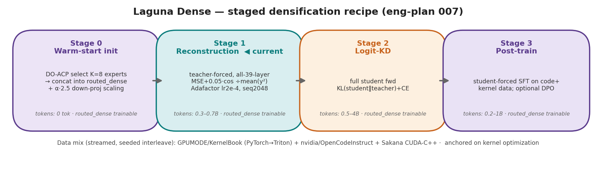
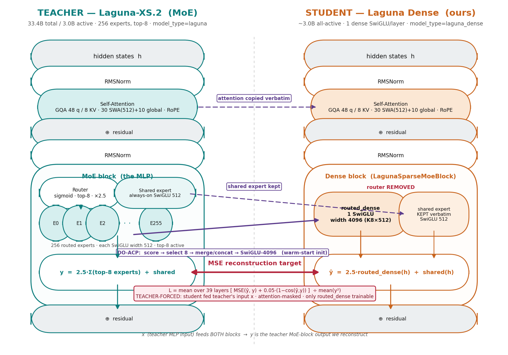

# Laguna Dense — end-to-end training recipe

The authoritative, runnable pipeline that turns **`poolside/Laguna-XS.2`** (the **Laguna**
teacher: a 33.4B-total / 3.0B-active MoE, 256 experts top-8) into **Laguna Dense** (our
~3.0B all-dense student), then specializes it for CUDA-kernel generation.

> **Naming.** *Laguna* = the Poolside 33B MoE we distil **from**. *Laguna Dense* = our dense
> student. This directory ports the full recipe (distillation → SFT → GRPO → DPO) into one
> place, with every dataset, hyperparameter, and trainable-scope spelled out.



## The pipeline at a glance

| Stage | Script | Method | Trainable | Loss | Tokens |
|---|---|---|---|---|---|
| **0 · Build + warm-start** | `scripts/00_build_dense_placeholder.py` (+ `densify_layer.py`) | copy shell from teacher; **DO-ACP** select K=8 experts → concat into one SwiGLU; fold 2.5×α into down-proj | — (init) | — | 0 |
| **1 · Reconstruction** | `scripts/01_train_dense_reconstruction.py` | teacher-forced per-layer activation matching, all 39 layers in parallel | `routed_dense` | `mean_ℓ(MSE + 0.05·(1−cos)) ÷ mean(y²)` | 0.3–0.7B |
| **2 · Logit-KD** *(optional)* | `scripts/02_train_dense_sft.py --kd-*` | full student forward, KL to teacher logits | `routed_dense (+norms)` | `KL(student‖teacher) + CE` | 0.5–4B |
| **3a · SFT Mix A** | `scripts/02_train_dense_sft.py` | general-code recovery on OpenCodeInstruct | `routed_dense + norms + lm_head` | CE | ~10M |
| **3b · SFT Mix B** | `scripts/sft_kernel.py` | CUDA recovery on Sakana AI-CUDA-Engineer | `routed_dense + lm_head + norms` | CE | ~3.5M |
| **4 · GRPO** | `scripts/grpo_kernel.py` | Dr.GRPO + DAPO, verifiable kernel reward | `routed_dense + lm_head` | policy-gradient + KL anchor | — |
| **5 · DPO** | `scripts/dpo_sakana.py` | offline preference (correct+fast ≻ incorrect/slow) | `routed_dense + lm_head` | DPO (Rafailov) | — |

Architecture of the swap (one decoder layer):



See **[MIXTURES.md](MIXTURES.md)** for every dataset ID, weight, and field mapping.

---

## 0. Hardware & environment

Reconstruction (Stage 1) needs the **33B teacher resident in bf16 next to the student**
(~66 GB + ~6 GB + activations), so it wants an 80 GB GPU; SFT/GRPO/DPO fit comfortably on
one 80 GB card. Recipe runs used **H100 PCIe 80 GB** (all-39-layer with Adafactor) and a
**GB300** for headroom; this checkout is validated on **A100 80 GB**.

```text
$ nvidia-smi
NVIDIA-SMI 595.71.05   Driver Version: 595.71.05   CUDA Version: 13.2
NVIDIA A100 80GB PCIe          81920MiB   sm_80
```

```bash
python -m venv .venv && source .venv/bin/activate
pip install -r training/requirements.txt

export HF_HOME=/data/hf_cache          # keep model/dataset cache off the OS disk
export HF_TOKEN=$(cat ~/.cache/huggingface/token)
export PYTHONPATH=src                   # densify.* package lives in src/
export CUDA_HOME=/usr/local/cuda        # needed for the GRPO/eval kernel compiler
```
All model loads use `trust_remote_code=True` (the `laguna` / `laguna_dense` classes ship in
the checkpoint). A working `nvcc` is required for Stage 4 and KernelBench eval.

---

## 1. Stage 0 — build the dense student + DO-ACP warm-start

Replace every routed MoE block (256 experts, top-8) with one dense SwiGLU and copy the rest
of the network verbatim.

```bash
# Build the dense placeholder (copied shell from the teacher; routed_dense to be filled):
python scripts/00_build_dense_placeholder.py \
    --source-model poolside/Laguna-XS.2 \
    --k-routed 8 \
    --target-dir outputs/laguna-dense-k8-copied-shell
```
The dense FFN width is `K × moe_intermediate(512)` → **K=8 = 4096**. K is a planned sweep
(8 → 16 → 32); C4 diagnostics show ~158 effective experts/layer, so K=8 matches the router's
top-8 capacity but under-fits deep layers.

**DO-ACP warm-start** (`src/densify/densify_layer.py`) — instead of random routed_dense init,
score and select 8 experts per layer and concatenate them (the single biggest convergence
lever):
- `compute_routing_stats` / `compute_expert_stats` → routing freq/weights + expert-output Gram.
- `select_do_acp(routing, experts, k=8)` → greedy `arg max log det(K_S + λI)` on the
  importance-weighted Gram `K_ij = √(I_iI_j)·G_ij`, `I = ACP = cp·√E‖f‖²` (importance **and**
  diversity; frequency scoring alone picks redundant experts).
- `build_dense_ffn(mlp, idx, routing, scaling="marginal")` → concat `gate/up`, fold
  `2.5·α_e` (routed scaling × marginal routing weight) into `down`.

> The two source papers (RADLADS 2505.03005, KRAFTON MoE→Dense 2605.28207) assume softmax
> router + ReLU FFN. Laguna uses **sigmoid routing, SwiGLU, an always-on shared expert, and a
> 2.5× routed scaling** — so we keep the shared expert as-is and fold the 2.5× into down-proj.

---

## 2. Stage 1 — reconstruction (the distillation core)

Train **only** `*.routed_dense.*` so the dense FFN reproduces the teacher's MoE-block output.
Teacher-forced and all-39-layer-parallel, so an untrained early layer never corrupts a later
layer's input (no error compounding). **What the MSE is taken from:** a forward hook on each
teacher `mlp` captures input `x_ℓ` and output `y_ℓ = 2.5·Σ(top-8 experts)+shared`; the student
MLP is fed the *teacher's* `x_ℓ`; loss matches `ŷ_ℓ` to `y_ℓ`.

```bash
python scripts/01_train_dense_reconstruction.py \
    --teacher-model  poolside/Laguna-XS.2 \
    --student-model  outputs/laguna-dense-k8-copied-shell \
    --datasets "GPUMODE/KernelBook:0.40,nvidia/OpenCodeInstruct:0.30,SakanaAI/AI-CUDA-Engineer-Archive:0.20:level_1,ppbhatt500/kernelbook-triton-multiturn-reasoning-traces:0.10" \
    --optimizer adafactor --learning-rate 2e-4 \
    --seq-len 2048 --grad-accum-steps 2 \
    --cosine-weight 0.05 --normalize-loss \
    --max-steps 2000 --save-every 500 \
    --output-dir outputs/recon_v2
```
- **Optimizer = Adafactor** (≈0 extra state) so the full 39-layer run fits on 80 GB; AdamW's
  m+v for 0.98B trainable ≈ 7.9 GB pushes teacher+student+state over budget.
- `--normalize-loss` divides each layer's MSE by `mean(y²)` so deep, large-magnitude layers
  don't dominate.
- Expected: V2 loss **0.672 → 0.163** (V1 OpenCode-only: 0.691 → 0.332). Per-layer metrics are
  logged to `outputs/recon_v2/metrics.jsonl`.
- **Caveat:** low teacher-forced MSE ≠ low perplexity. Score with perplexity + SWE-bench
  (`pool`), not MSE alone.

Output: `outputs/recon_v2/checkpoint-final` → pushed as `EvanOLeary/laguna-xs2-dense-k8-recon`
(and `…-kernelmix` for the V2 mix).

---

## 3. Stage 3 — SFT (two mixes)

**Mix A — general-code recovery** (recovers chat + broad code generation):
```bash
python scripts/02_train_dense_sft.py \
    --model outputs/recon_v2/checkpoint-final \
    --dataset data/opencodeinstruct_chat.jsonl \
    --seq-len 8192 --lr 5e-5 --max-steps 500 \
    --train-norms --train-lm-head \
    --output-dir outputs/sft_opencode
    # optional logit-KD: --kd-dataset data/kd.jsonl --kd-weight 0.5 --kd-temperature 1.0
```

**Mix B — CUDA kernels** (PyTorch → CUDA-C++, correct kernels only):
```bash
python scripts/sft_kernel.py \
    --student-model EvanOLeary/laguna-xs2-dense-k8-kernelmix \
    --dataset SakanaAI/AI-CUDA-Engineer-Archive --splits level_1,level_2 \
    --max-steps 400 --seq-len 2048 --grad-accum-steps 8 --learning-rate 1e-5 \
    --output-dir outputs/sft_cuda
```
Trainable scope in both: `routed_dense + lm_head + norms` (attention frozen, no teacher needed).

---

## 4. Stage 4 — GRPO (verifiable RL for kernels)

`scripts/grpo_kernel.py` — **Dr.GRPO** (advantage = `r − mean(r)`, no std/length norm) +
**DAPO dynamic sampling** (skip zero-variance groups). Reward is the verifiable
`src/densify/kernel_reward.py` signal:

```
parse +0.10 · compile +0.20 · correct vs eager +0.40 · speedup +0.30·min(spd,3)/3   →  ~[-0.2, 1.0]
```
(`evaluate_kernel` compiles via `torch.utils.cpp_extension.load_inline`, checks `allclose`
vs the eager reference, times 50 iters; SIGALRM-guarded. A Triton path exists too.)

```bash
python scripts/grpo_kernel.py \
    --model outputs/sft_cuda/checkpoint-final \
    --group-size 6 --max-new-tokens 400 \
    --lr 1e-6 --kl-beta 0.02 --temperature 0.9 --steps 30 \
    --output-dir outputs/grpo
```
Trainable `routed_dense + lm_head`; the SFT model is also the frozen KL reference.

---

## 5. Stage 5 — DPO (offline preference)

`scripts/dpo_sakana.py` — mines the Sakana archive's evolutionary traces: per task, **prefer
the correct + fastest kernel over an incorrect/slower one** (verified `Correct` +
`CUDA_Speedup_Native`), no live compilation.

```bash
python scripts/dpo_sakana.py \
    --model outputs/sft_cuda/checkpoint-final \
    --splits level_1,level_2 --max-tasks 200 --pairs-per-task 8 \
    --beta 0.1 --lr 5e-7 --steps 300 \
    --output-dir outputs/dpo
```
`L = −log σ(β[(logπ−logπ_ref)(chosen) − (logπ−logπ_ref)(rejected)])`; reference = frozen SFT
model; trainable `routed_dense + lm_head`.

---

## 6. Evaluation
- `scripts/kernelbench_lite_eval.py`, `scripts/eval_worker.py`, `scripts/eval_10ops_isolated.py`
  — compile + correctness + speedup on KernelBench-style ops (uses the same
  `kernel_reward.evaluate_kernel`). `scripts/head_to_head.py` compares student vs teacher.
- Score the dense model with **perplexity + SWE-bench (`pool`)** for the end-to-end signal, not
  reconstruction MSE.

## 7. Gotchas (from the run logs)
- **tqdm clobbers loss in piped logs** — read `outputs/*/metrics.jsonl` (authoritative), not stdout.
- **Chat template:** render with `apply_chat_template(..., tokenize=False)` then tokenize;
  `tokenize=True` is buggy for this tokenizer. Use `enable_thinking=False` for generation.
- **Custom modeling files** (`modeling_laguna_dense.py`, `configuration_laguna_dense.py`,
  `chat_template.jinja`) must sit in every saved checkpoint dir or `trust_remote_code` load fails.
- **Sakana split is `level_1/level_2`, not `train`.**

## 8. Provenance
- **Ported from `cm2435/laguna-xs2-expert-coactivation-scheduling`** (branch
  `recipe/paper-aligned-densification-kernel-data` @ `7b9dd15`, and `docs/dense-placeholder-training-plan`):
  `densify_layer.py`, `reconstruction.py`, `dense_checkpoint/*`, `00_build_dense_placeholder.py`,
  `01_train_dense_reconstruction.py`, `02_train_dense_sft.py`.
- **Already in this repo:** `sft_kernel.py`, `grpo_kernel.py`, `dpo_sakana.py`,
  `rft_offline_sakana.py`, `src/densify/kernel_reward.py`, eval harnesses.
- Papers: RADLADS arXiv:2505.03005 · KRAFTON MoE→Dense arXiv:2605.28207.
